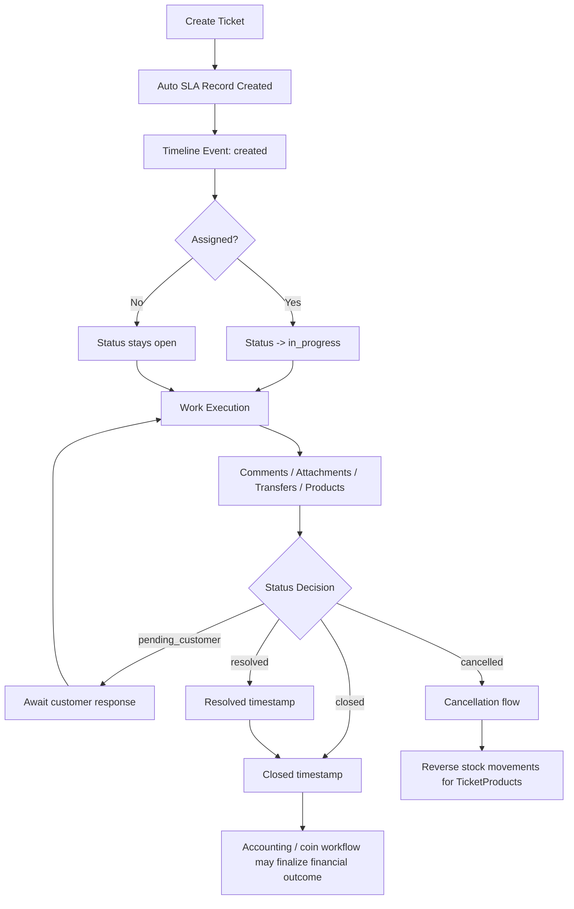
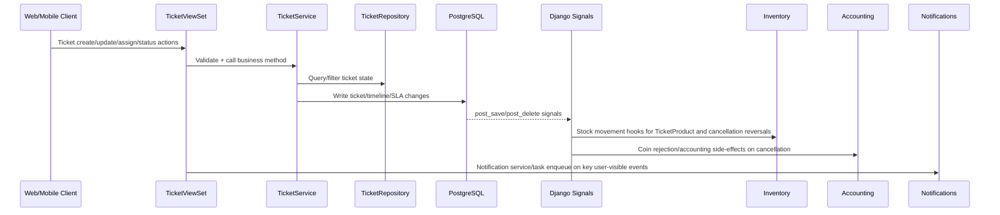

# Ticket Management System

## 1) Overview

The ticket management module is the operational core of NEXUS BMS. It manages support/service tickets from creation through assignment, execution, resolution, closure, and cancellation.

Current implementation center:
- `backend/tickets/models.py`
- `backend/tickets/views.py`
- `backend/tickets/services/ticket_service.py`
- `backend/tickets/repositories/ticket_repo.py`

### Primary Responsibilities

- Ticket intake and structured classification (`TicketType`, `TicketCategory`, `TicketSubCategory`)
- Lifecycle control (`open`, `in_progress`, `pending_customer`, `resolved`, `closed`, `cancelled`)
- Assignment and collaboration (`assigned_to`, `team_members`)
- SLA deadline creation and breach/warning reporting (`TicketSLA`)
- Operational traceability (`TicketTimeline`, comments, transfers, attachments)
- Product usage linkage (`TicketProduct`) for inventory consumption
- Billing handoff for invoice/finance flow (via accounting services/signals)

## 2) Key Features

- Tenant-scoped isolation for all ticket entities via `TenantModel`
- Ticket number generation per tenant (`ticket_number`)
- Role-based action controls in viewsets
- Soft-delete behavior for tickets
- Timeline audit stream for all major ticket events
- Nested APIs for comments/products/attachments under tickets
- Product add/remove hooks connected to stock movement and reversals
- SLA endpoints for warning and breached tickets

## 3) Workflow

## 3.1 End-to-End Lifecycle

## 3.2 Step-by-Step Flow

1. Ticket creation
- API: `POST /api/v1/tickets/`
- Service creates `Ticket` and `TicketSLA` and writes a `TicketTimeline` created event.
- SLA deadline defaults from `TicketType.default_sla_hours` or fallback 24 hours.

2. Assignment and activation
- API action assigns primary or team members.
- If primary assignee is set while open, status transitions to `in_progress`.
- Membership checks ensure assignees belong to the same tenant.

3. Execution phase
- Staff adds comments, attachments, and transfer records.
- Product usage is attached through `TicketProduct` under the ticket.
- Timeline entries are appended for assign/comment/transfer/product actions.

4. SLA monitoring
- SLA data is queryable via warning and breached endpoints.
- Deadlines are persisted in `TicketSLA` and exposed in ticket serializer output.

5. Resolution and closure
- Status updates set `resolved_at` and `closed_at` where applicable.
- Ticket may remain open for finance or validation workflows before final closure.

6. Cancellation path
- On cancellation, inventory return movements are generated for ticket products.
- Accounting signals can reject pending coin transactions for cancelled work.

## 4) How It Works (Component Interaction)

## 4.1 Layered Behavior

## 4.2 Integration Points

- Tickets -> Inventory
  - `TicketProduct` creation triggers stock-out movement via inventory signal listener.
  - Ticket cancellation triggers return movements.

- Tickets -> Accounting
  - Ticket-driven invoice generation and approval flow can close ticket and create coin transactions in accounting service flow.
  - Ticket cancellation causes pending coin rejection via accounting signal.

- Tickets -> Notifications
  - Notification service creates in-app records and enqueues async email/push tasks for assignment/comments/SLA.

## 4.3 Multi-Tenant Operation

- Tenant is resolved at middleware level and attached to request.
- Ticket APIs and queries are tenant-filtered.
- Cross-tenant assignment is blocked through membership checks.

## 5) Architecture Analysis

## 5.1 Is Ticket Management a Completely Separate Module?

Short answer: No, not completely separate.

It is a distinct domain module (`backend/tickets`), but operationally coupled with:
- `inventory` via Django signal-based stock movements
- `accounting` via signal and service-level invoice/coin effects
- `notifications` via direct service/task invocation

So the module boundary is clear at folder/domain level, but runtime behavior is interconnected and partially coupled.

## 5.2 Is the System Event-Driven?

Short answer: Partially, but not fully event-driven.

What exists now:
- Strong use of Django model signals for reactive side-effects.
- Asynchronous delivery for notification transport via Celery tasks.

What is missing for full event-driven architecture:
- Central `EventBus` implementation and subscription registry in `core`.
- Standardized event catalogue enforcement in runtime code.
- Domain events published from service layer for each lifecycle change.
- Decoupled listeners that consume named events instead of relying on direct model signal coupling.

